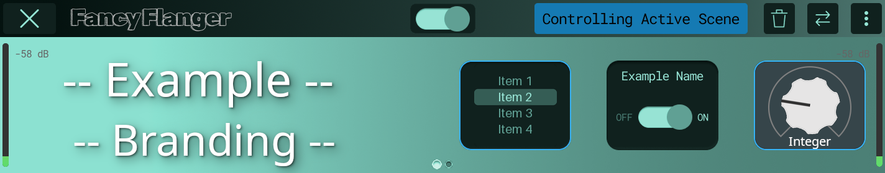
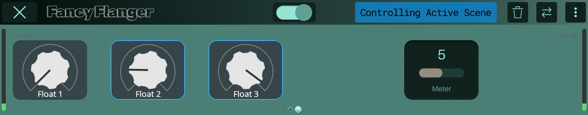

# Audio Plugin Documentation for Darkglass Anagram

This repository contains documentation and examples related to developing audio plugins for [Darkglass Anagram](https://www.darkglass.com/products/anagram/) as a platform.

NOTE: This document is a WORK IN PROGRESS! Please bare with us while we set up all the documentation, examples and tools.

NOTE: Custom block image and settings styling as mentioned in this document requires KosmOS >= v1.14.

## Styling

It is possible to stylize the block image and block settings of a plugin through the use of a [custom Darkglass LV2 extension](https://github.com/Darkglass-Electronics/LV2-Extensions/blob/main/dg-custom-styling.lv2/custom-styling.ttl).  
This extension defines properties related to alignment, fonts, images, overlays, positioning and size.

For a high-level overview of all the possible properties and their relationship see [custom-styling.hpp](https://github.com/Darkglass-Electronics/mod-connector/blob/main/src/custom-styling.hpp) which is a C++ representation used by our LV2 host.

Because many plugin frameworks automatically generate LV2 ttl, we recommend to store all the styling related information in a separate file and only reference it through "seeAlso" on the `manifest.ttl` entry point.  
For example:

```ttl
@prefix lv2:  <http://lv2plug.in/ns/lv2core#> .
@prefix rdfs: <http://www.w3.org/2000/01/rdf-schema#> .

<https://mycompany.com/products/MyPlugin>
    a lv2:Plugin ;
    lv2:binary <MyPlugin.so> ;
    rdfs:seeAlso <MyPlugin.ttl> , <Styling.ttl> .
```

In the example above we manually add `<Styling.ttl>` to the `rdfs:seeAlso` property, so if the plugin framework (or any other generator) replaces the main plugin ttl file we won't lose our changes.

If your ttl files are hand-crafted you might prefer to store everything together. Both choices are valid.

## Resources

Customization of a plugin's block image and block settings can be done through image and/or font files.  
Any file referenced by the plugin is assumed to live within its LV2 bundle, references to files outside the LV2 bundle are rejected.

In this document when we reference images we imply the use of PNG files.  
When we reference fonts we imply the use of types natively supported by FreeType, which Anagram uses for external font rendering.

An image property requires a path, it can also provide alignment and offset but they are optional as not always relevant.  
If the image belongs to a parameter control, animation frames must be used (from min to max).  
If the image belongs to a bypass control, at least 2 animation frames are required (on is first, then off/bypassed).  
If the image belongs to a block, animation frames are optional (if present: on is first, then off/bypassed)

A font property requires a path and size.

Note: the use of custom fonts is not yet implemented as of KosmOS v1.14.

## Block Image

The plugin's block image can be customized in 3 ways:

 1. The block image itself; It can contain multiple frames for on/off animation (on is first, then off/bypassed)
 2. Bypass parameter widget
 3. Parameter-specific widgets, connected to a control port by symbol

For KosmOS v1.14 our focus is in the block settings, so this area is still work-in-progress.  
Point 3 can already be used for displaying some metering directly on the block image, Ignissor is a good example of this.  
Non-metering parameters are not supported yet.

Because we allow the block image itself to be customized, we end up having 3 different images for it:

 1. The required `dg:blockImageOff` (shown by default on OFF state)
 2. The required `dg:blockImageOn` (shown by default on ON state)
 3. The block image animated frames

It is important that we always have the first 2 above, as they are used when referring to a plugin where animations are not wanted - for example in the plugin selection screen.
The 3rd case above is used only inside the signal chain screen, allowing for a smooth transition between ON and OFF states.

### Examples

Here is how Ignissor does its dynamic compression metering:

```ttl
@prefix dgcs: <http://www.darkglass.com/lv2/ns/lv2ext/custom-styling#> .
@prefix lv2: <http://lv2plug.in/ns/lv2core#> .

<urn:darkglass:ignissor>
    dgcs:blockImage [
        a dgcs:BlockImage ;

        # custom background, potentially with animation frames (not the case in Ignissor)
        dgcs:path <background.png> ;

        # list of output parameters used for monitoring
        dgcs:parameters [
            # we connect a widget to a control port through its symbol
            lv2:symbol "GainReductionLoSteps" ;

            # path to image with animation frames
            dgcs:path <meter.png> ;

            # where to position the image relative to the block top-left point
            dgcs:x 57 ;
            dgcs:y 61 ;

            # indicate width of a single frame, so KosmOS can auto-detect the number of frames
            # in Ignissor we use horizontal frames, so we can skip dgcs:height here
            # if you use vertical frames make sure to provide dgcs:height for a single frame
            # or alternatively just provide both dgcs:width and dgcs:height at the same time
            dgcs:width 21;

        # more of the same...
        ] , [
            lv2:symbol "GainReductionMidSteps" ;
            dgcs:path <meter.png> ;
            dgcs:x 89 ;
            dgcs:y 61 ;
            dgcs:width 21;
        ] , [
            lv2:symbol "GainReductionHiSteps" ;
            dgcs:path <meter.png> ;
            dgcs:x 122 ;
            dgcs:y 61 ;
            dgcs:width 21;
        ] ;
    ] .
```

## Block Settings

Pretty much everything in the block settings can be stylized, but one notable exception as of KosmOS v1.14 are the peakmeters.

While we allow custom styling, for the sake of consistency and good user experience, we do not allow reposition of certain UI components.  
These include everything in the top-bar and non-knobs-aligned parameters.

For parameters we allow them to be reordered, but always within a fixed 6-slot grid in order to align nicely with the physical knobs above it.

### Examples

We provide an extensive example plugin for block settings' customization [examples/lv2-custom-styling](examples/lv2-custom-styling).  
Its somewhat ugly but on purpose, as it is mostly for show-casing and testing all the possible image replacements supported so far.

When deployed to an Anagram, its block settings will look like this:




In this example you can see:

- Background image that spans 2 pages
- Initial padding of the first parameter, to allow some custom branding
- Custom block name
- Custom pagination dots
- Custom bypass toggle
- Custom top-bar buttons
- Custom list-style parameter
- Custom toggle-style parameter
- Custom integer parameter
- Custom regular/float parameters
- Custom output meter parameter
- The output meter parameter in a custom position
